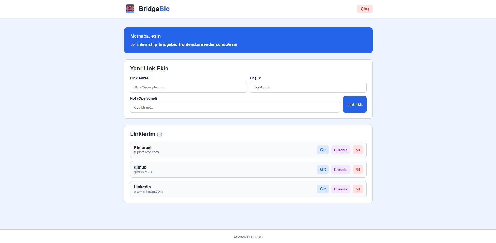

# 🌉 BridgeBio - Profesyonel Link Yönetim & Paylaşım Platformu

[](https://reactjs.org/)
[](https://nodejs.org/)
[](https://expressjs.com/)
[](https://supabase.com/)
[](https://render.com/)

BridgeBio, modern web standartlarına uygun olarak tasarlanmış, kullanıcıların kendi kişiselleştirilmiş profil sayfalarını oluşturarak sosyal medya, iş ve kişisel bağlantılarını tek bir merkezden yönetmelerini sağlayan full-stack bir web uygulamasıdır.

Bu proje, staj programı Web Geliştirme Javascript Projesi kapsamında geliştirilmiştir.

---

## Ekran Görüntüsü


---

## Öne Çıkan Özellikler

Güvenli Üyelik & Oturum Yönetimi:
  - Kullanıcı kayıt (`/register`) ve giriş (`/login`) işlemleri.
  - JWT (JSON Web Token) tabanlı güvenli oturum kontrolü.
  - Şifrelerin bcryptjs ile 10 katmanlı (salt rounds) güvenli hashlere dönüştürülerek saklanması.
Gelişmiş Link CRUD Operasyonları:
  - Ekleme (Create):Başlık, URL ve özel açıklama/not bilgileriyle yeni bağlantı kartları oluşturma.
  - Listeleme (Read): Eklenen tüm linklerin React state yönetimi ile anında listelenmesi.
  - Güncelleme (Update): Kart üzerinden tek tıkla düzenleme moduna geçiş ve anında güncelleme.
  - Silme (Delete): Onay pencereli güvenli silme işlemi.
Herkese Açık Profil Sayfası:
  - `https://domain.com/public/:username` formatında, herkes tarafından erişilebilen kişiselleştirilmiş profil sayfası.
  - Ziyaretçiler üye girişi yapmadan paylaşılan linkleri görüntüleyebilir.
Premium Pure CSS Tasarım:
  - Bootstrap veya Tailwind CSS gibi hazır kütüphaneler kullanılmadan, tamamen özelleştirilmiş el yapımı CSS (`main.css`) kullanılarak kodlandı.
  - Göz yormayan modern renk paleti, Glassmorphic (cam efekti) kart tasarımları, gölgelendirmeler ve yumuşak hover animasyonları ile premium arayüz deneyimi.
Supabase Bulut Veritabanı Entegrasyonu:
  - İlişkisel veritabanı yapısı (Users ve Links tabloları arası Foreign Key ilişkisi).
  - Yüksek performanslı ve güvenli veri sorguları.

---

## Teknik Altyapı & Teknolojiler

| Katman | Teknoloji / Kütüphane | Açıklama |
| :--- | :--- | :--- |
| **Frontend** | **ReactJS (v18)** | SPA (Single Page Application) yapısı ve dinamik state yönetimi. |
| **Routing** | **React Router DOM (v6)** | Sayfalar arası akıcı ve güvenli yönlendirme. |
| **Stil/Tasarım** | **Pure CSS (Glassmorphism)** | Tamamen el yapımı, duyarlı (responsive) modern tasarım sistemi. |
| **Backend** | **Node.js & Express** | RESTful API standartlarına uygun backend mimarisi. |
| **Veritabanı** | **Supabase (PostgreSQL)** | Bulut üzerinde güvenli ilişkisel veritabanı. |
| **Güvenlik** | **JWT & BcryptJS** | Kimlik doğrulama ve şifre güvenliği altyapısı. |
| **Dağıtım (Host)**| **Render** | Canlı sunucu ortamı entegrasyonu. |

---

## Proje Dizin Yapısı

Proje, backend ve frontend katmanlarının bağımsız geliştirilebilmesi için modüler bir yapıda kurgulanmıştır:

```text
BridgeBio_staj/
├── backend/                  # API Sunucu Kodları
│   ├── middleware/           # Kimlik doğrulama ara yazılımları (authMiddleware)
│   ├── routes/               # API Yönlendiricileri (authRoutes, linkRoutes)
│   ├── server.js             # Sunucu başlangıç noktası
│   ├── supabaseClient.js     # Supabase DB bağlantı istemcisi
│   └── package.json          # Backend bağımlılıkları ve scriptleri
│
├── frontend/                 # React Arayüz Kodları
│   ├── src/
│   │   ├── components/       # Tekrar kullanılabilir UI bileşenleri (Header, Footer, LinkCard)
│   │   ├── pages/            # Ekranlar (Home, Login, Register, PublicProfile)
│   │   ├── styles/           # Global stil tanımlamaları (main.css)
│   │   ├── App.jsx           # Ana yönlendirme ve sayfa yönetimi
│   │   └── index.js          # React DOM render başlangıç noktası
│   └── package.json          # Frontend bağımlılıkları ve scriptleri
```

---

## Kurulum ve Çalıştırma

### 1. Depoyu Klonlayın
```bash
git clone https://github.com/esinceritsahin/internship_bridgebio.git
cd internship_bridgebio
```

### 2. Backend Kurulumu
Backend dizinine geçip bağımlılıkları yükleyin:
```bash
cd backend
npm install
```

`.env` dosyasını oluşturup aşağıdaki değişkenleri tanımlayın:
```env
PORT=5000
JWT_SECRET=super_secret_jwt_anahtari
SUPABASE_URL=https://your-supabase-project.supabase.co
SUPABASE_KEY=your-supabase-service-role-key-or-anon-key
```

Sunucuyu geliştirme modunda başlatın:
```bash
npm run dev
```
*Backend `http://localhost:5000` adresinde çalışacaktır.*

### 3. Frontend Kurulumu
Ana dizine dönüp frontend dizinine geçin ve bağımlılıkları yükleyin:
```bash
cd ../frontend
npm install
```

`.env.local` dosyasını oluşturup backend API adresinizi girin:
```env
REACT_APP_API_URL=http://localhost:5000
```

Uygulamayı başlatın:
```bash
npm start
```
*Frontend otomatik olarak tarayıcınızda `http://localhost:3000` adresinde açılacaktır.*

---

## API Endpoints (Uç Noktalar)

### Kimlik Doğrulama (`/api/auth`)
* `POST /api/auth/register` - Yeni kullanıcı kaydı.
* `POST /api/auth/login` - Giriş yapar ve JWT Token döner.

### Link Yönetimi (`/api/links`)
* `GET /api/links` - **[Giriş Gerekli]** Giriş yapmış kullanıcının tüm linklerini getirir.
* `POST /api/links` - **[Giriş Gerekli]** Yeni bir link ekler.
* `PUT /api/links/:id` - **[Giriş Gerekli]** Belirtilen ID'ye sahip linki günceller.
* `DELETE /api/links/:id` - **[Giriş Gerekli]** Belirtilen ID'ye sahip linki siler.
* `GET /api/links/public/:username` - Belirtilen kullanıcı adına ait herkese açık profili ve linkleri listeler.

---

## Veritabanı Şeması (Supabase)

Projenin sorunsuz çalışabilmesi için Supabase üzerinde kurulmuş olan tablo yapıları:

### 1. `users` Tablosu
```sql
CREATE TABLE users (
  id UUID DEFAULT gen_random_uuid() PRIMARY KEY,
  username VARCHAR(255) UNIQUE NOT NULL,
  password_hash VARCHAR(255) NOT NULL,
  created_at TIMESTAMP WITH TIME ZONE DEFAULT timezone('utc'::text, now()) NOT NULL
);
```

### 2. `links` Tablosu
```sql
CREATE TABLE links (
  id UUID DEFAULT gen_random_uuid() PRIMARY KEY,
  user_id UUID REFERENCES users(id) ON DELETE CASCADE,
  title VARCHAR(255) NOT NULL,
  url TEXT NOT NULL,
  note TEXT,
  created_at TIMESTAMP WITH TIME ZONE DEFAULT timezone('utc'::text, now()) NOT NULL
);
```

---

## Lisans
Bu proje staj değerlendirme projesi olarak hazırlanmış olup, tüm hakları saklıdır.
